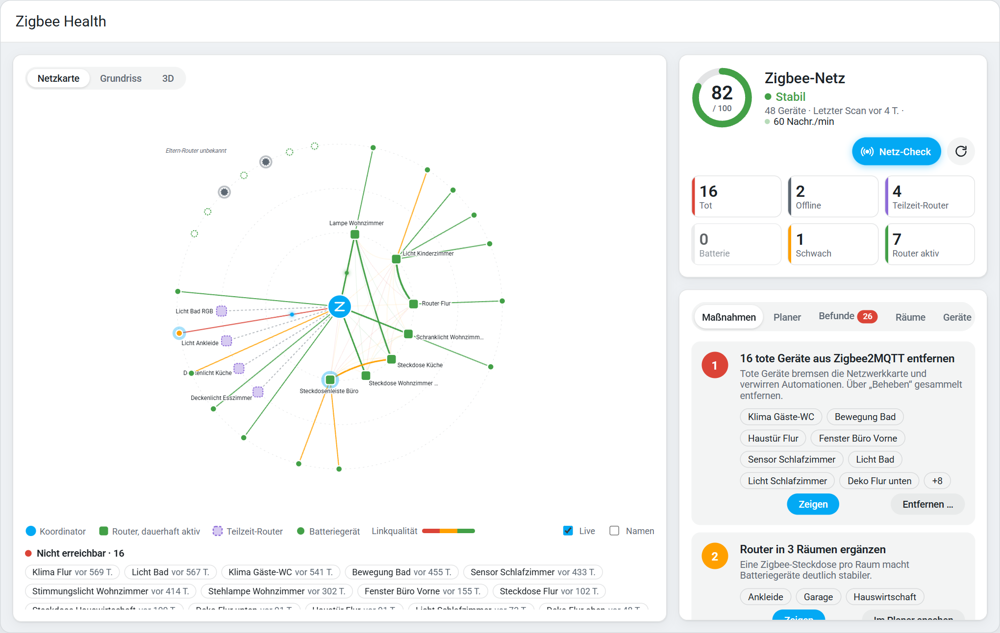
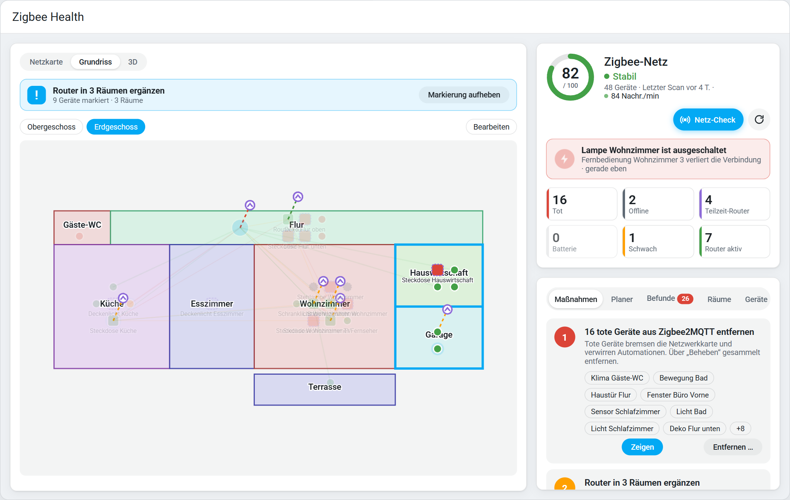
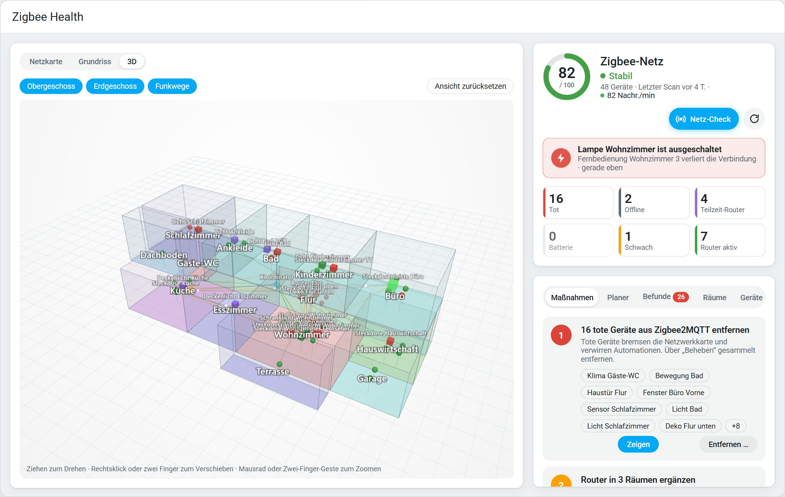
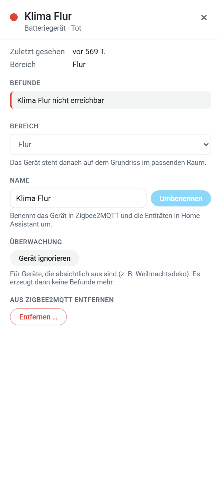

# Zigbee Health

[](https://hacs.xyz/)
[](https://github.com/Mastershort/zigbee-health/releases)
[](https://github.com/Mastershort/zigbee-health/actions/workflows/tests.yml)

**English** · [Deutsch](#deutsch)

Zigbee Health analyses your **Zigbee2MQTT** network in Home Assistant and tells you **why** it misbehaves and **what** to do about it: dead devices, lamps on wall switches that tear holes into the mesh, empty batteries, weak links, rooms without a router. With a live network map, a floor plan you draw yourself and a rotatable 3D view of your home.

Local only, no cloud. Zigbee Health only reads along – your network is changed only when you explicitly confirm an action.

> **Beta:** 0.10 is the first public version. It has been tested on one real network so far – feedback and bug reports are very welcome.



## Features

- **Network health score** (0–100) and status *stable / expect dropouts / fragile*, plus a score per room and per device.
- **Top 3 measures** for your network – *Show* marks the affected devices and rooms on the map, the floor plan and in 3D.
- **Live network map**: coordinator in the centre, always-on routers inside, part-time routers (lamps on wall switches) dashed, battery devices outside next to their parent. Line colour = link quality. Live traffic flies along the routes.
- **Wall switch alarm**: a router that goes offline (lamp switched off at the wall) is reported immediately together with the devices that lose their connection.
- **Network check** and **router planner**: simulates an additional Zigbee plug in every room with the real rules and shows where it helps most.
- **Draw your floor plan** right in Home Assistant: rectangles or free shapes in metres, exact sizes, snapping, undo, several storeys, optional background image. Link each room to a Home Assistant area and your devices place themselves.
- **3D view**: your drawn home with all storeys to rotate, pan and zoom – devices, links by LQI, live traffic and alarms in 3D.
- **Device panel**: click any device to see its details and findings, assign an area, rename it (in Zigbee2MQTT incl. HA entities), ignore it or remove it from Zigbee2MQTT – one device at a time, always with confirmation.
- **Repairs**: concrete issues with instructions in the Home Assistant repairs dashboard, similar ones bundled; fix flows to remove dead devices, ignore devices or findings and enable missing Z2M options.
- **Entities**: network sensors (health, status, dead, offline, part-time routers, weak links, …), optional per-device sensors attached to the existing Z2M devices (Zigbee state, health, parent router, LQI to parent, battery forecast, children) and per-room health.
- **Actions, events, device triggers**: `zigbee_health.scan_network`, `get_report` (with response, e.g. for notifications or Assist), `ignore`, `unignore`, `reset_history`; events and device triggers for new / resolved findings, status changes, finished scans and routers going offline.

| Floor plan with marked rooms | 3D view | Device panel |
|---|---|---|
|  |  |  |

### Detected problems

| | Finding | | Finding |
|---|---|---|---|
| F-01 | Dead device | F-10 | Unstable device (reconnects) |
| F-02 | Recently disappeared | F-11 | Message flood (device / network) |
| F-03 | Battery probably empty | F-12 | Overloaded parent router |
| F-04 | Battery forecast | F-13 | Room without an always-on router |
| F-05 | Part-time router (wall switch) | F-14 | Too few routers |
| F-06 | End devices on a part-time router | F-15 | Z2M option missing (`last_seen`, `availability`, `health`) |
| F-07 | Weak link | F-16 | Outdated coordinator firmware |
| F-08 | Weak router backbone | F-17 | Pairing incomplete / device not supported |
| F-09 | Link getting worse | F-18 | Devices without an area |

Details and thresholds (German): [docs/FINDINGS.md](docs/FINDINGS.md).

## Requirements

- Home Assistant **2025.1** or newer with the **MQTT integration** set up
- **Zigbee2MQTT 2.0** or newer
- Recommended in Zigbee2MQTT: `advanced.last_seen` (e.g. `ISO_8601`), `availability` and `health` – Zigbee Health offers to enable them for you

## Installation

### HACS (recommended)

[](https://my.home-assistant.io/redirect/hacs_repository/?owner=Mastershort&repository=zigbee-health&category=integration)

Or manually: HACS → ⋮ → *Custom repositories* → `https://github.com/Mastershort/zigbee-health`, type *Integration* → download **Zigbee Health** → restart Home Assistant.

### Manual

Copy `custom_components/zigbee_health` into your `config/custom_components/` folder and restart Home Assistant.

### Set up

Settings → Devices & services → *Add integration* → **Zigbee Health**. The Zigbee2MQTT base topic is detected automatically. **Zigbee Health** then appears in the sidebar.

| When | What happens |
|---|---|
| immediately | Device "Zigbee Health (…)" with its sensors (unavailable until the first analysis) |
| after 2 min | first network scan |
| after 10 min | first analysis – or right away with the **Analyse now** button |
| after +30 min | issues appear in the repairs dashboard (protection against flapping) |

### How often does it scan?

| What | How often |
|---|---|
| **Network scan** (Z2M network map: neighbours and LQI) | once per night, 03:30 by default – time adjustable or off; optionally only when nobody is home |
| **Analysis** (findings, score, measures) | every 5 minutes, from the regular Z2M messages |
| **Live traffic and wall switch alarm** | in real time |

A network scan puts load on the Zigbee network for a few minutes, so it runs at night. *Network check* in the panel scans again when the last scan is older than 6 hours; *Scan network now* (button or action) scans right away.

## Dashboard card

The integration ships its own card and loads it automatically – no resource and no separate frontend package needed:

```yaml
type: custom:zigbee-health-card
```

Options in the visual editor: title, Zigbee network, start view, show all names.

## FAQ

**Why is a router shown as dead although it works?** Routers only count as dead when they have been silent for ≥ 30 days **and** did not answer the last network scan. If it answers the next scan, the finding disappears.

**What is a part-time router?** A router (e.g. a lamp) that was unreachable in 2 of 3 scans or often goes offline – usually switched off at the wall. Devices connected through it lose their connection.

**I don't want to see a finding any more.** Choose *Ignore* in the repair dialog or in the device panel, or use the ignore list in the integration options.

**Does it change my network?** Only when you confirm it: removing or renaming a device, or enabling a Z2M option. Everything else is read-only.

## Development

- Python analyzer without Home Assistant imports: `custom_components/zigbee_health/analyzer/` – tests: `pytest tests/analyzer`
- Integration tests (Linux): `pytest tests/integration`
- Frontend (Lit + TypeScript): `cd frontend && npm install && npm run build` – sources in `frontend/src`, output in `custom_components/zigbee_health/frontend/`
- Standalone preview with the anonymised demo network: `python scripts/preview_data.py && python scripts/build_preview.py`

Bug reports: please attach the diagnostics (Settings → Devices & services → Zigbee Health → ⋮ → *Download diagnostics*).

---

## Deutsch

Zigbee Health wertet dein **Zigbee2MQTT**-Netz in Home Assistant aus und sagt dir, **warum** es zickt und **was** du tun sollst: tote Geräte, Lampen am Wandschalter, die Lücken ins Netz reißen, leere Batterien, schwache Verbindungen, Räume ohne Router. Mit Live-Netzkarte, selbst gezeichnetem Grundriss und 3D-Ansicht deines Hauses.

Alles lokal, keine Cloud. Zigbee Health liest nur mit – am Netz wird nur etwas geändert, wenn du es ausdrücklich bestätigst.

> **Beta:** 0.10 ist die erste öffentliche Version. Rückmeldungen und Fehlerberichte sind sehr willkommen.

### Was du bekommst

- **Netz-Gesundheit** (0–100) und Status *stabil / mit Aussetzern zu rechnen / fragil*, dazu Werte pro Raum und Gerät
- **Top-3-Maßnahmen** – *Zeigen* markiert die betroffenen Geräte und Räume auf Netzkarte, Grundriss und in 3D
- **Live-Netzkarte** mit Funkverkehr und **Wandschalter-Alarm**
- **Netz-Check** und **Router-Planer**: wo bringt die nächste Zigbee-Steckdose am meisten?
- **Grundriss selbst zeichnen** (Rechteck oder freie Form, Maße in Metern, mehrere Etagen, Bild als Vorlage); Räume mit HA-Bereichen verknüpfen, Geräte stellen sich selbst hinein
- **3D-Ansicht** zum Drehen, Verschieben und Zoomen
- **Geräte-Panel**: Details, Bereich zuweisen, umbenennen, ignorieren oder aus Zigbee2MQTT entfernen – immer nur ein Gerät, immer mit Bestätigung
- **Reparaturen**, **Entitäten**, **Aktionen**, **Ereignisse** und **Geräte-Auslöser** wie oben beschrieben

### Installation

HACS → ⋮ → *Benutzerdefinierte Repositories* → `https://github.com/Mastershort/zigbee-health`, Typ *Integration* → **Zigbee Health** herunterladen → Home Assistant neu starten. Danach Einstellungen → Geräte & Dienste → *Integration hinzufügen* → **Zigbee Health**. Das Basis-Topic wird automatisch erkannt, **Zigbee Health** erscheint in der Seitenleiste.

Voraussetzungen: Home Assistant 2025.1+, MQTT-Integration, Zigbee2MQTT 2.0+. Empfohlen in Zigbee2MQTT: `last_seen`, `availability` und `health` – Zigbee Health bietet an, das für dich einzuschalten.

### Scans

Der Netzwerk-Scan läuft einmal pro Nacht (Standard 03:30 Uhr, einstellbar oder abschaltbar, optional nur wenn niemand zuhause ist). Ausgewertet wird alle 5 Minuten aus den normalen Z2M-Meldungen, Live-Verkehr und Wandschalter-Alarm kommen in Echtzeit. *Netz-Check* scannt neu, wenn der letzte Scan älter als 6 Stunden ist.

### Dashboard-Beispiel mit Standard-Karten

```yaml
type: vertical-stack
cards:
  - type: gauge
    entity: sensor.zigbee_health_zigbee2mqtt_netz_gesundheit
    name: Zigbee-Netz
    severity: {green: 80, yellow: 55, red: 0}
  - type: glance
    entities:
      - sensor.zigbee_health_zigbee2mqtt_tot
      - sensor.zigbee_health_zigbee2mqtt_offline
      - sensor.zigbee_health_zigbee2mqtt_teilzeit_router
      - sensor.zigbee_health_zigbee2mqtt_batterie_kritisch
      - sensor.zigbee_health_zigbee2mqtt_schwache_verbindungen
  - type: button
    entity: button.zigbee_health_zigbee2mqtt_netzwerk_jetzt_scannen
```

Die Entitäts-IDs hängen von Sprache und Instanzname ab – bei Bedarf anpassen.

### FAQ

**Warum steht ein Router als „tot“ da, obwohl er läuft?** Router gelten nur als tot, wenn sie seit ≥ 30 Tagen still sind **und** im letzten Netzwerk-Scan nicht geantwortet haben.

**Was ist ein Teilzeit-Router?** Ein Router (z. B. Lampe), der in 2 von 3 Scans nicht erreichbar war oder oft offline geht – meist am Wandschalter ausgeschaltet.

**Ich will einen Hinweis nicht mehr sehen.** Im Reparatur-Dialog oder im Geräte-Panel „Ignorieren“ wählen, oder in den Integrations-Optionen → Ignorierliste.

Fehlerberichte bitte mit Diagnosedaten (Einstellungen → Geräte & Dienste → Zigbee Health → ⋮ → *Diagnosedaten herunterladen*).

## License

MIT
